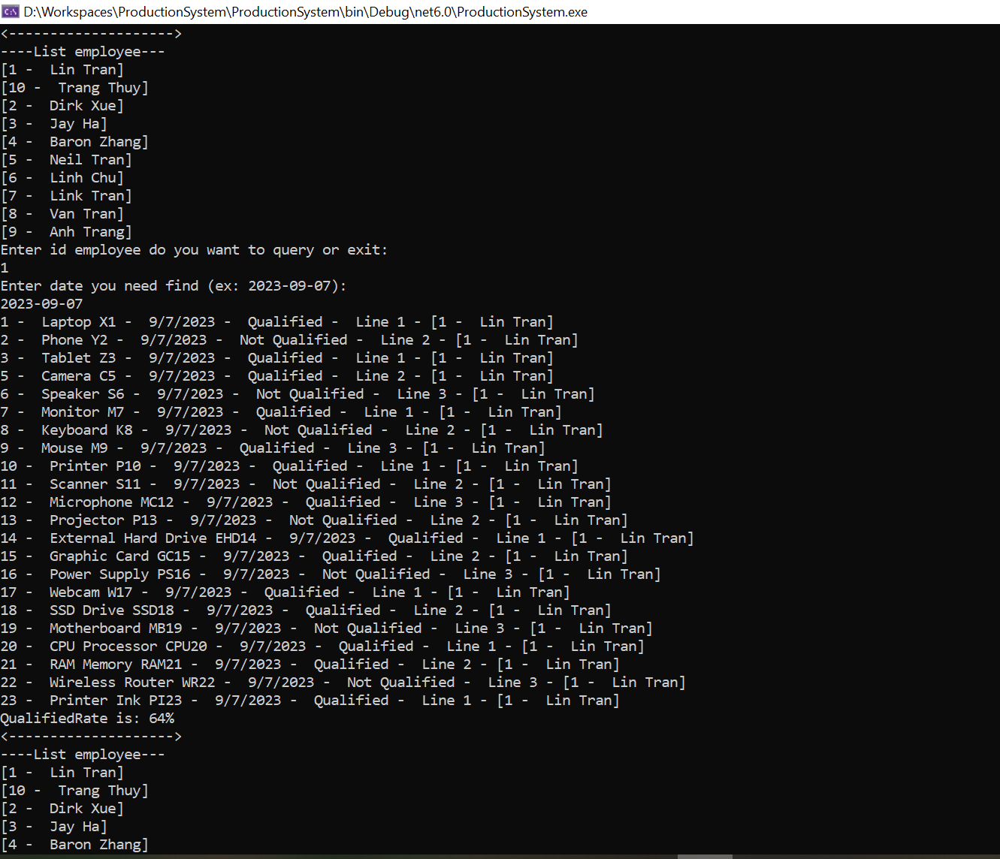
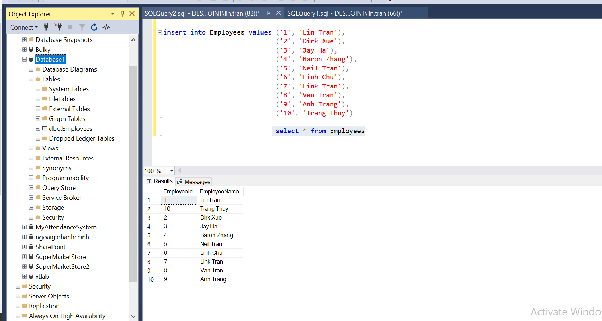
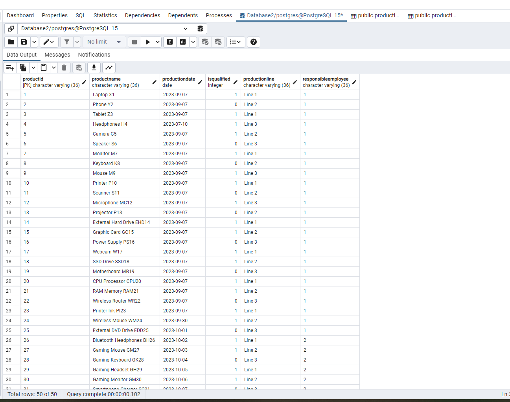

Required:
 You have two databases, which may not necessarily be SQL Server databases. One contains an "Employees" table, and the other contains a "Production" table. The "Employees" table includes fields such as EmployeeID, EmployeeName, and approximately 10 employees. The "Production" table includes fields such as ProductID, ProductName, ProductionDate, IsQualified, ProductionLine, and ResponsibleEmployee.

The "Production" table represents production records. Your task is to create an application that can query the production records for a specific employee on a given day and calculate the production's quality rate. Please note that due to potential database differences, you should aim to use abstract ADO.NET model classes instead of specific providers and utilize a Dataset for unified cross-database operations.

